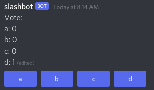

A simple Discord bot that provides a poll command using the [Slash Command API](https://discord.com/developers/docs/interactions/slash-commands).


Requires the following environment variables, which can be set in an `.env` file:
- `APPLICATION_ID` from https://discord.com/developers/applications
- `DISCORD_TOKEN` from https://discord.com/developers/applications/{APPLICATION_ID}/bot

## Usage:
Command name: `poll`

Options:
- `options`, accepts a comma separated list
```
/poll options:a,b,c,d
```


The poll stops accepting new votes after 5 minutes.

## License
Licensed under the GNU Affero General Public License Version 3 or any later version.
